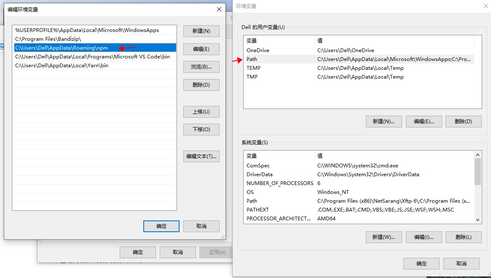
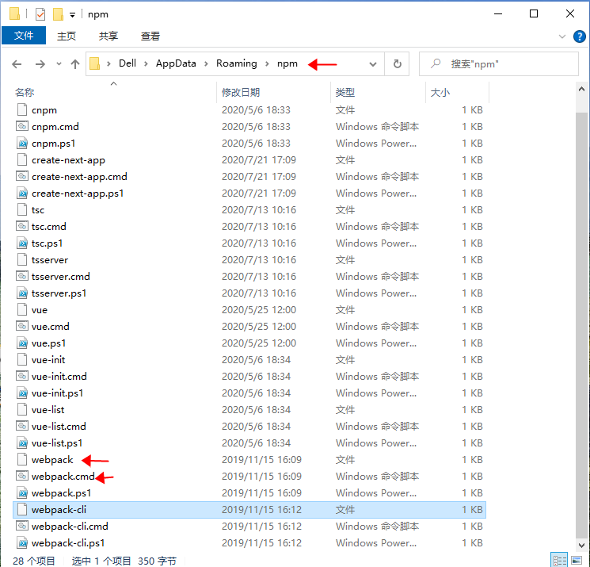
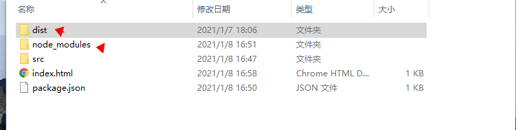
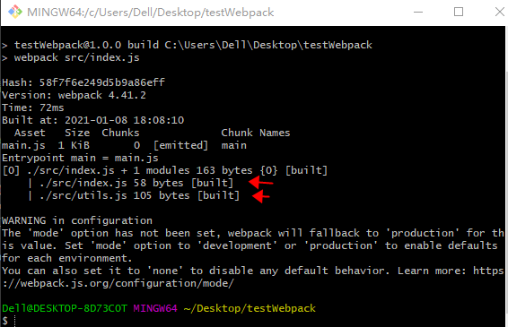

##### 前言

+ 安装npm

+ 安装webpack和webpack-cli（注意安装webpack时要指定版本，不然就变成了5版本，本文讨论的是@4.x）

  > + 需要注意的是webpack4拆分为 webpack和webpack-cli这两个包
  >

+ package.json中的scripts字段和bin字段

  > 以webpack包为例：
  >
  > + 为什么可以直接在命令行中执行 ` webpack scr/index.js  ` 命令？
  >
  > 首先，全局安装webpack后，webpack包中package的字段如下：
  >
  > ```javascript
  > {	
  >     //...省略
  >    "bin": "./bin/webpack.js", 
  >     //...省略
  > }
  > ```
  >
  > npm会收集bin字段，生成相应的shell/cmd脚本储存在全局的环境变量path中对应的npm目录（用yarn安装的就是在yarn目录下）
  >
  > 
  >
  > 
  >
  > ______
  >
  > 执行wepack命令就是在环境变量path中对应的目录下**查找**叫webpack的程序，即webpack.cmd
  >
  > 如下，关键点就是用node去执行bin字段对应的文件即"./bin/webpack.js"文件
  >
  > 环境变量相关知识点可参考：https://blog.csdn.net/n_s_x14/article/details/88081530
  >
  > cmd文件如下：
  >
  > ```shell
  > @ECHO off
  > SETLOCAL
  > CALL :find_dp0
  >
  > IF EXIST "%dp0%\node.exe" (
  >   SET "_prog=%dp0%\node.exe"
  > ) ELSE (
  >   SET "_prog=node"
  >   SET PATHEXT=%PATHEXT:;.JS;=;%
  > )
  >
  > "%_prog%"  "%dp0%\node_modules\webpack\bin\webpack.js" %*
  > ENDLOCAL
  > EXIT /b %errorlevel%
  > :find_dp0
  > SET dp0=%~dp0
  > EXIT /b
  > ```
  >
  > -----
  >
  > 但通常我们是执行的 npm run build这个命令来打包的，这个大家应该都知道是去package中找scripts字段，执行相应的命令
  >
  > ```javascript
  > "scripts": {
  >     "build": "webpack",
  >   },
  > ```
  >
  > 其实就是相当于新打开一个shell窗口，执行  ` webpack ` 这个命令而已
  >
  > 注意：项目本地安装的包中的bin字段，会被收集到/node_modules/.bin 文件夹下，即webpack只在本地安装的时候也可以使用上面的build命令，类似于先在本地查找命令，未找到再去全局的path目录下找。

##### 基本配置

+ webpack4号称0配置，那直接执行  `webpack  ` 试试

  > 坑：webpack4.x的打包已经不能用`webpack 文件a 文件b`的方式，而是直接运行`webpack --mode development`或者`webpack --mode production`，这样便会默认进行打包，入口文件是`'./src/index.js'`，输出路径是`'./dist/main.js'`，其中src目录即index.js文件需要手动创建，而dist目录及main.js会自动生成。 

  ​

  ```javascript
  // src/index.js
  import {sum ,clg} from './utils'
  export default {sum,clg}

   // src/utils.js

    export function clg(value) {
        console.log(value)
          }

    export function sum(a, b) {

   return a + b
   }
  ```


  执行后：

    


    新增dist目录，和目录下的main.js

    

  可以很明显的看出入口文件，以及在入口文件中依赖了哪些文件，按图索骥都打包进来了

  同时有一个配置的警告，执行webpack 的时候未输入mode选项，所以默认为production，也告诉我们还有developent，和none模式。none模式禁止默认行为，代表在其他模式时，webpack内部都有做一些事情，很明显的就是：production下打包出来的代码默认是压缩的。

  ​

  + 但对不同的项目来说，肯定有自定义的需求，所以配置文件还是需要的

  ```javascript
  "scripts": {
      "build": "webpack --config webpack.config.js", // --config 指定后面的文件为配置文件
    }, 
  ```

  + 根据我们上面提到的出口，入口，模式，先将配置文件写成如下

> 注意整个配置中我们使用 Node 内置的 [path 模块](https://nodejs.org/api/path.html)，并在它前面加上 [__dirname](https://nodejs.org/docs/latest/api/globals.html#globals_dirname)这个全局变量。可以防止不同操作系统之间的文件路径问题，并且可以使相对路径按照预期工作

```javascript
const path = require('path');

module.exports = {
  mode: "production", // "production" | "development" | "none"  

  entry: "./src/index.js",  //不设置时默认为 /src/index.js
 
  output: {
    path: path.resolve(__dirname, "dist"), // string
    filename: "bundle.js", // string  默认为main.js
  }  
}
```

基本的配置文件就完成啦，简单的后果就是最后只能打包js文件和json文件

> webpack 开箱即用只支持js和json，通过loaders去支持其他的文件类型，并把它们添加到依赖图中。
> loaders本身是一个函数，接收源文件作为参数，返回转换的结果

- 常见的loaders有哪些？

| 名称            | 作用              |
| ------------- | --------------- |
| babel-loader  | 转化es6 es7新特性语法  |
| css-loader    | 支持css文件的加载和解析   |
| less-loader   | 将less文件转化为css文件 |
| ts-loader     | 将ts文件转化为js文件    |
| file-loader   | 进行图片和字体的打包      |
| raw-loader    | 将文件以字符串的形式打包    |
| thread-loader | 多进程打包js和css     |

- loaders的使用

> test 指定规则， use指定loader

```javascript
module: {    // 为什么叫模块,在node中不同的文件就是不同的模块，处理模块就是处理文件啦
    rules: [{
      test: /\.txt$/,
      use: 'raw-loader'
    }]
  }
```

+ plugins概念

> 插件用于bundle.js文件 的优化，资源管理和环境变量的注入，作用于整个构建过程
>
> 插件更多是功能性的，主要也是借助node的能力去实现的功能

- 常见的plugins有哪些？

| 名称                       | 作用                        |
| ------------------------ | ------------------------- |
| CommonsChunkPlugin       | 将chunks相同的代码提取到公共的js      |
| CleanWebpackPlugin       | 清理构建目录（构建前）               |
| ExtractTextWebpackPlugin | 将bundle里的css提取成一个css文件    |
| CopyWebpackPlugin        | 将文件(夹)拷贝到构建目录             |
| HtmlWebpackPlugin        | 创建html文件去承载打包好的js文件（自动引入） |
| UglifyjsWebpackPlugin    | 压缩js（有一个压缩配置，自己去选择怎么压缩）   |
| ZipWebpackPlugin         | 将打包的资源生成一个zip包(避免自己手动压缩)  |

- 用法

> 插件实例化

```javascript
plugins: [
    new HtmlWebpackPlugin({
      template: './src/index.html'   // 当有定制html需求时使用
    }),
  ]
```

```
// 生成的文件
<!DOCTYPE html>
<html>
  <head>
    <meta charset="UTF-8">
    <title>webpack App</title>
  </head>
  <body>
    <script src="bundle.js"></script>
  </body>
</html>
```

好的 一个简单的配置文件就写好了

```javascript
const path = require('path');

module.exports = {
  mode: "production", // "production" | "development" | "none"  

  entry: "./src/index.js",  //不设置时默认为 /src/index.js
 
  output: {
    path: path.resolve(__dirname, "dist"), // string
    filename: "bundle.js", // string  默认为main.js
  },
  
  module: {    // 为什么叫模块,在node中不同的文件就是不同的模块，处理模块就是处理文件啦
    rules: [{
      test: /\.txt$/,
      use: 'raw-loader'
    }]
  },
  
  plugins: [
    new HtmlWebpackPlugin(),
  ]
}
```

下一篇文章主题为：用webpack定制完整的react开发环境