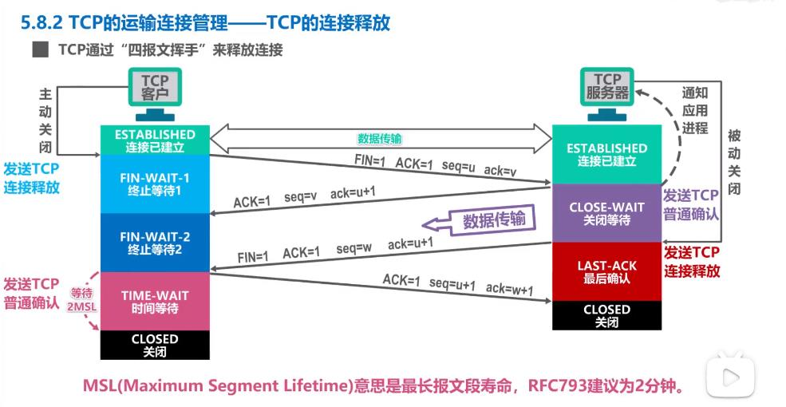
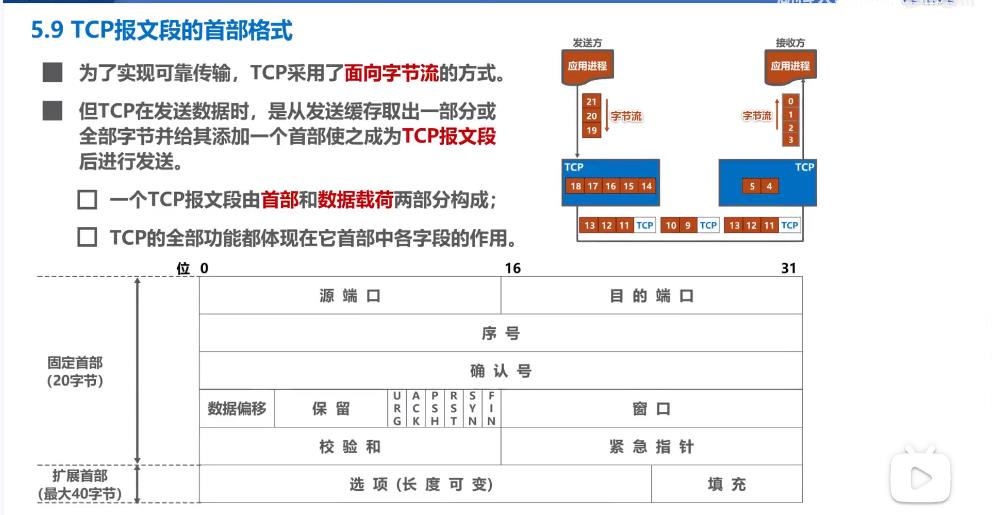

##### [UDP和TCP的对比]()

udp-user datagram protocol 用户数据报协议

tcp- transmission control protocol 传输控制协议

对比：

udp

1 无连接的

2  支持 单播 多播 广播通信

3 面向应用报文（既不合并，也不拆分，保留边界）

4 对误码 和丢失报文等异常情况不做处理

5 首部仅8个字节

tcp

1 面向连接的，要进行三报文握手建立连接，四报文挥手释放连接

2  仅支持单播，一对一通信

3  面向字节流的（实现可靠传输，流量控制，拥塞控制的基础）

4 提供可靠的传输服务

5 首部最小20字节，最大60字节

##### tcp流量控制

什么是流量控制？

是让发送方的发送速率不要太快，要让接收方来得及接收

利用滑动窗口机制可以在tcp连接上实现流量控制

例子：初始cwnd窗口大小为1-400

##### tcp拥塞控制

 拥塞控制四种算法：

+ 慢开始
+ 拥塞避免
+ 快重传
+ 快恢复

假定如下条件：

+ 数据是单方向传输的，另一方只传送确认信息
+ 接收方总是有足够大的缓存空间，因而发送方的拥塞窗口大小由网络的拥塞程度来决定
+ 以最大报文段MSS来的个数来作为讨论的单位，而不是字节

拥塞控制全流程示例

慢开始：cwnd翻倍

拥塞避免：达到慢开始门限值，变为cwnd逐步加一，发生超时重传时，慢开始门限值变为当前cwnd的一半，cwnd变为1，又开始之前的慢开始流程

快重传：收到三个重复确认时（不是超时重传），进行快重传，此时不启动慢开始算法，而是启动快恢复算法，

快恢复：发送方将慢开始门限值更新为当前cwnd的一半，cwnd更新为门限值

##### tcp超时重传

RTT-一个传输轮次的往返时间

超时重传的时间要略大于RTT，

要注意超时重传时，RTO直接取为旧RTO的2倍

、

##### tcp可靠传输的实现

+ tcp基于字节为单位的滑动窗口来实现可靠传输
  1. 发送方在未收到接收方的确认信息时，可将发送窗口内未发送的数据全部发送出去
  2. 接收方只接受落入发送窗口的数据
+ 虽然发送方的发送窗口是根据接收方的接收窗口设置的，但同一时刻，双方的窗口值不一定同样大
  1. 网络传输窗口值需要一定的时间
  2. 发送方还可能根据网络的阻塞情况调整自己的窗口值
+ 对于不按序到达的数据，tcp并未规定如何处理
  1. tcp通常对不按序到达的数据先临时存放在接收窗口中，等到缺失的字节收到后，再按序交付给上传应用
+ tcp要求接收方必须由累计确认机制和捎带确认机制，这样可以减小传输开销，接收方可以在自己合适的时候发送数据，也可以在自己要发送数据的时候捎带确认信息
  1. 接收方不应过分延迟发送确认信息，否则会导致超时重传（一般是不能超过0.5秒）
  2. 捎带确认实际上很少发生，因为应用程序很少同时发送数据
+ tcp通信是全双工通信，通信双方都可以接收和发送数据，也就是都拥有自己的发送窗口和接收窗口

##### tcp连接管理

+ tcp的运输连接有以下三个阶段

  1 建立tcp连接

  2 数据传输

  3 释放tcp连接

+ 连接管理主要解决的问题

  1.  使tcp双方能感知对方的存在
  2.  使tcp双方能协商一些参数（如最大窗口值，是否使用窗口扩大选项，时间戳选项以及服务质量）
  3.  tcp双方能够对运输实体资源进行分配（缓存大小，连接表中的项目）

+ tcp使用“三报文握手”建立连接

  1. 客户端发送连接请求   

     > SYN=1 seq=x(任意)   此时客户端为SYN-SENT状态

  2. 发送针对TCP连接请求的确认

     > SYN=1 ACK=1 seq=y(任意)  ack=x+1(x已经被用掉了)    此时服务器端为SYN-RCVD状态

  3. 客户端再发送一个针对确认的确认，普通的tcp确认报文段（可携带数据，不携带下一个报文段序号还为x+1）

     > ACK=1 seq=x+1  ack=y+1    状态为连接已建立  

  4. tcp服务器接收后，状态变为 ESTABLISHED，开始数据传输

+ 为什么要三握手？

  是为了防止已失效的连接请求报文突然又传到tcp服务器，因而导致错误

+ tcp的连接释放--四次挥手

  1. 客户端发送tcp连接释放请求   

     > FIN=1  ACK=1 seq=x(任意) ack=v   此时客户端为FIN-wait-1

  2. tcp服务器发送针对TCP释放请求的普通确认

     >  ACK=1 seq=v+1  ack=x+1(x已经被用掉了)    此时服务器端为CLOSE-WAIT状态   客户端收到后变为FIN-wait-2状态，此时只允许服务器向客户端发送数据了

  3. tcp服务器再发送一个连接释放请求  

     > FIN=1  ACK=1 seq=w  ack=x+1 此时服务端为LAST-ACK

  4. tcp客户端接收后，发送普通的确认报文

     > 状态变为 TIME-WAIT，经过2个MSL（最长报文段寿命，RFC793建议2分钟）后变为close状态，连接断开
     >
     > ACK=1 seq=x+1 ack=w+1

     

+ 保活机制

  + tcp服务器每收到一次客户进程的数据，就重启保活计时器（2小时定时）
  + 计时周期内未收到数据，tcp服务器进程将发送一个探测报文，75秒发送一次，发送10后，还没有响应，则关闭这个连接

##### tcp的报文格式

