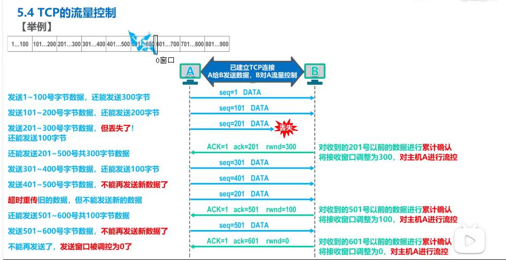
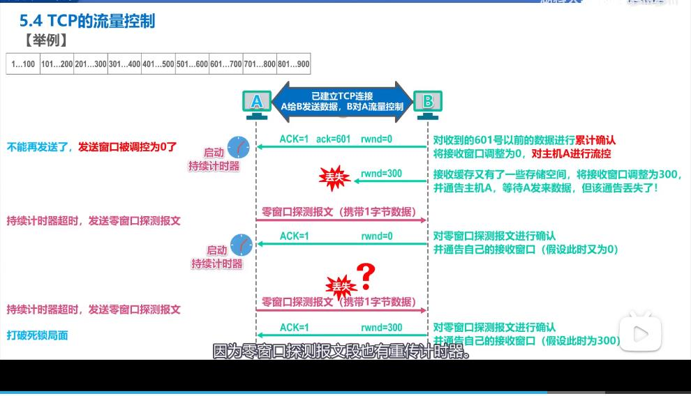

##### UDP和TCP的对比

udp-user datagram protocol 用户数据报协议

tcp- transmission control protocol 传输控制协议

对比：

udp

1 无连接的

2  支持 单播 多播 广播通信

3 面向应用报文（既不合并，也不拆分，保留边界）

4 对误码 和丢失报文等异常情况不做处理

5 首部仅8个字节

tcp

1 面向连接的，要进行三报文握手建立连接，四报文挥手释放连接

2  仅支持单播，一对一通信

3  面向字节流的（实现可靠传输，流量控制，拥塞控制的基础）

4 提供可靠的传输服务

5 首部最小20字节，最大60字节

##### tcp流量控制

什么是流量控制？

是让发送方的发送速率不要太快，要让接收方来得及接收

利用滑动窗口机制可以在tcp连接上实现流量控制

例子：初始cwnd窗口大小为1-400

