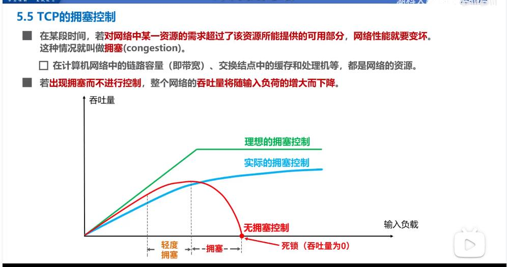
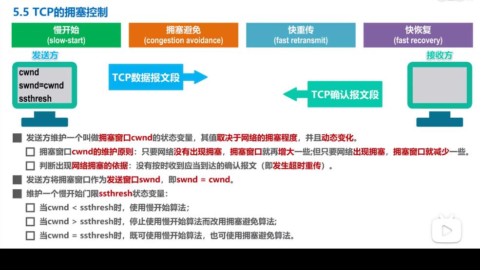
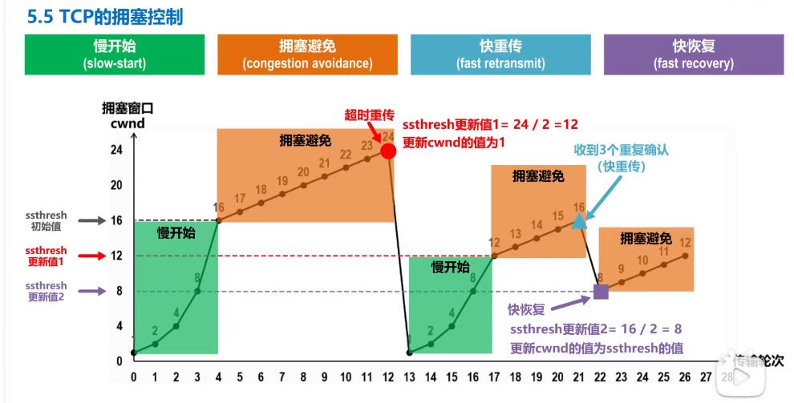
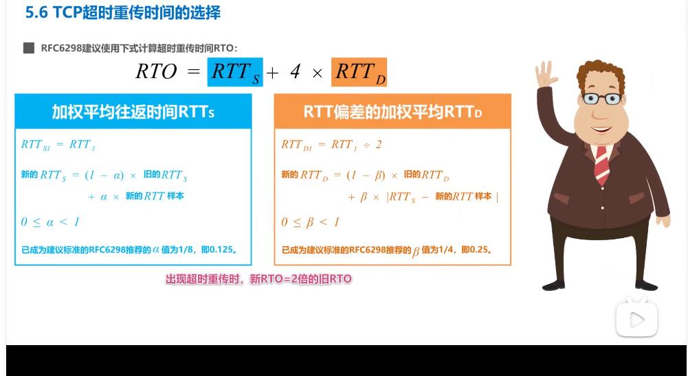

##### UDP和TCP的对比

udp-user datagram protocol 用户数据报协议

tcp- transmission control protocol 传输控制协议

对比：

udp

1 无连接的

2  支持 单播 多播 广播通信

3 面向应用报文（既不合并，也不拆分，保留边界）

4 对误码 和丢失报文等异常情况不做处理

5 首部仅8个字节

tcp

1 面向连接的，要进行三报文握手建立连接，四报文挥手释放连接

2  仅支持单播，一对一通信

3  面向字节流的（实现可靠传输，流量控制，拥塞控制的基础）

4 提供可靠的传输服务

5 首部最小20字节，最大60字节

##### tcp流量控制

什么是流量控制？

是让发送方的发送速率不要太快，要让接收方来得及接收

利用滑动窗口机制可以在tcp连接上实现流量控制

例子：初始cwnd窗口大小为1-400

##### tcp拥塞控制

 拥塞控制四种算法：

+ 慢开始
+ 拥塞避免
+ 快重传
+ 快恢复

假定如下条件：

+ 数据是单方向传输的，另一方只传送确认信息
+ 接收方总是有足够大的缓存空间，因而发送方的拥塞窗口大小由网络的拥塞程度来决定
+ 以最大报文段MSS来的个数来作为讨论的单位，而不是字节

拥塞控制全流程示例

慢开始：cwnd翻倍

拥塞避免：达到慢开始门限值，变为cwnd逐步加一，发生超时重传时，慢开始门限值变为当前cwnd的一半，cwnd变为1，又开始之前的慢开始流程

快重传：收到三个重复确认时（不是超时重传），进行快重传，此时不启动慢开始算法，而是启动快恢复算法，

快恢复：发送方将慢开始门限值更新为当前cwnd的一半，cwnd更新为门限值

##### tcp超时重传

RTT-一个传输轮次的往返时间

超时重传的时间要略大于RTT，

要注意超时重传时，RTO直接取为旧RTO的2倍

、

